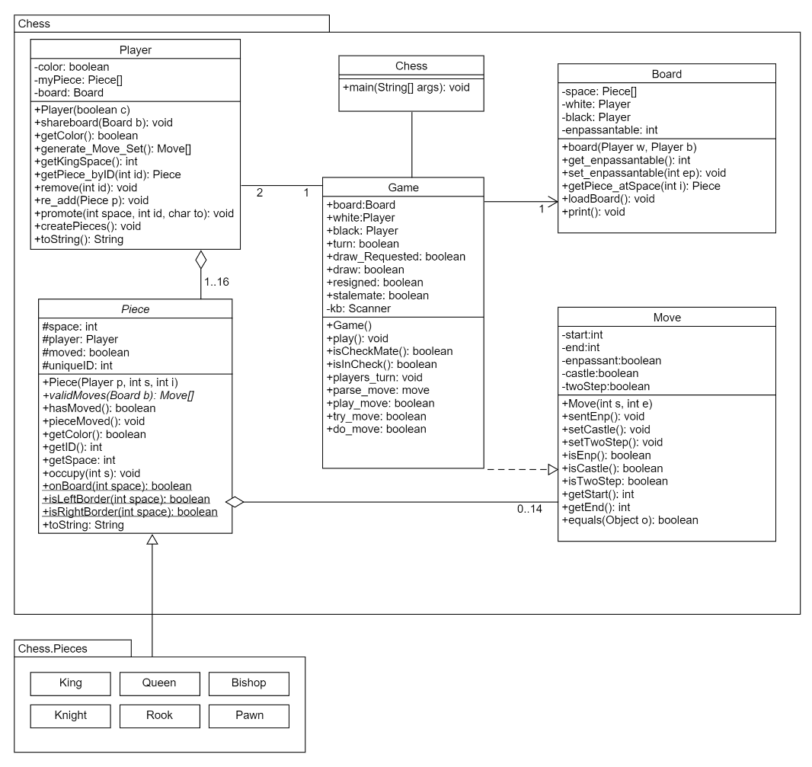

# Android Chess

Android implementation of chess, adapted from a [terminal version of chess](https://github.com/AndrewYW/Chess). Features all chess functions including castling, pawn promotion, and en passant. Additionally, it includes the option to record games and play then back move by move.
+ Minimum SDK: 21
+ Target SDK: 23

## Technology

This application was built completely with Java 8. Data storage was implemented using `java.io.Serializable` and stored locally 

### UML

### 1d array Board implementation

At the time of doing this project, my partner and I both hated doing any sort of 2d array calculation and movement, so we decided to see if we could implement a `Board` class with only a one dimensional array

### Serialization

### Playback